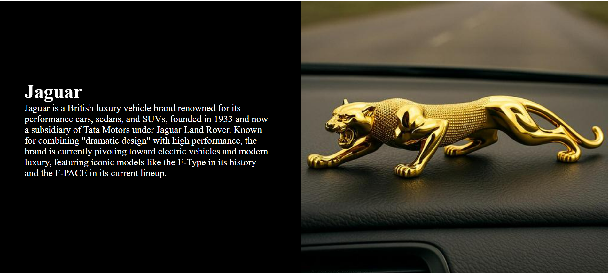
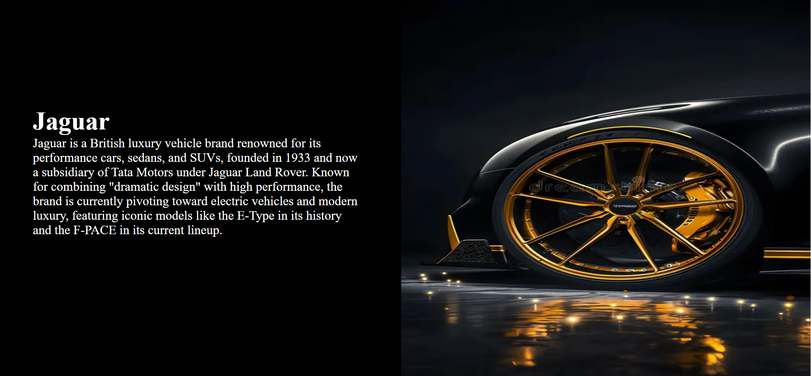

# jaguar-landing-page 🚘

A modern Jaguar-inspired landing page created using HTML and CSS.

This project is a beginner frontend practice project featuring luxury car visuals, stylish layout sections, and smooth UI design.

## ✨ Features

- Modern landing page design
- Luxury car themed UI
- Multiple image sections
- Clean layout structure
- Beginner-friendly frontend project

## 🛠 Technologies Used

- HTML5
- CSS3

## 📸 Project Preview

### Home Section

### Information Section

### Interior Section

## 🎥 Project Demo

demo-video.mp4

## 🎯 Purpose of Project

This project was created to practice:
- HTML structure
- CSS styling
- Landing page design
- Image positioning
- Frontend UI development

## 👨‍💻 Author

Made with Nikita Maurya
